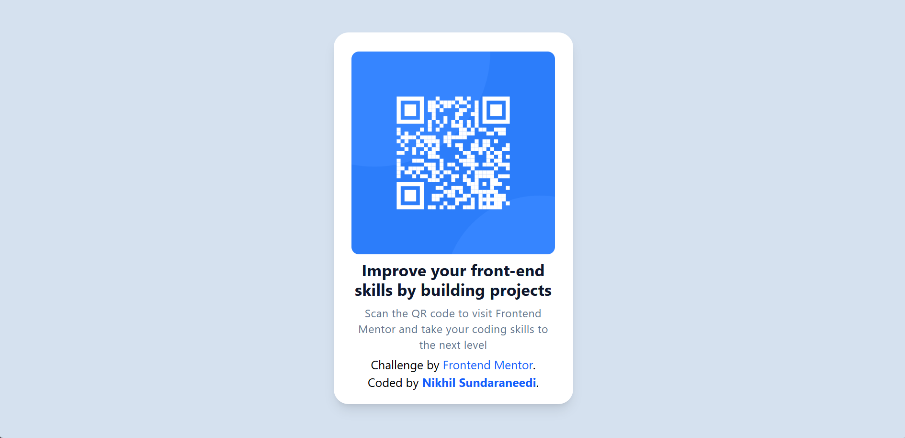

# Frontend Mentor - QR Code Component Solution

This is a solution to the [QR Code Component Challenge on Frontend Mentor](https://www.frontendmentor.io/challenges/qr-code-component-iux_sIO_H). Frontend Mentor challenges help you improve your coding skills by building realistic projects.

## Table of Contents

- [Overview](#overview)
    - [Screenshot](#screenshot)
    - [Links](#links)
- [My Process](#my-process)
    - [Built With](#built-with)
    - [What I Learned](#what-i-learned)
    - [Continued Development](#continued-development)
    - [Useful Resources](#useful-resources)
- [Author](#author)
- [Acknowledgments](#acknowledgments)

## Overview

### Screenshot



### Links

- **Solution URL:** [Frontend Mentor Solution](https://your-solution-url.com)
- **Live Site URL:** [Live Demo](https://qrcodecomponent-rho.vercel.app/)

## My Process

### Built With

- Semantic HTML5 markup
- CSS custom properties
- Flexbox
- Mobile-first workflow
- Tailwind CSS

### What I Learned

During this challenge, I improved my understanding of flexbox and responsive design principles. Here are some key takeaways:

```html
<div class="flex flex-col items-center justify-center">
  
</div>
```

### What I Learned

I also learned how to fine-tune typography and spacing using Tailwind CSS utilities.

## Continued Development

In future projects, I want to:

- Explore more complex layouts using CSS Grid.
- Improve accessibility practices.
- Work on animations and micro-interactions.

## Useful Resources

- [MDN Web Docs - Flexbox](https://developer.mozilla.org/en-US/docs/Learn/CSS/CSS_layout/Flexbox)
- [Tailwind CSS Documentation](https://tailwindcss.com/docs)

## Author

- **Frontend Mentor** - [Nikhil-coder390](https://www.frontendmentor.io/profile/Nikhil-coder390)
- **GitHub** - [Nikhil-coder390](https://github.com/Nikhil-coder390)

## Acknowledgments

Thanks to Frontend Mentor for providing these great challenges that help developers practice and improve their skills. 🚀  
